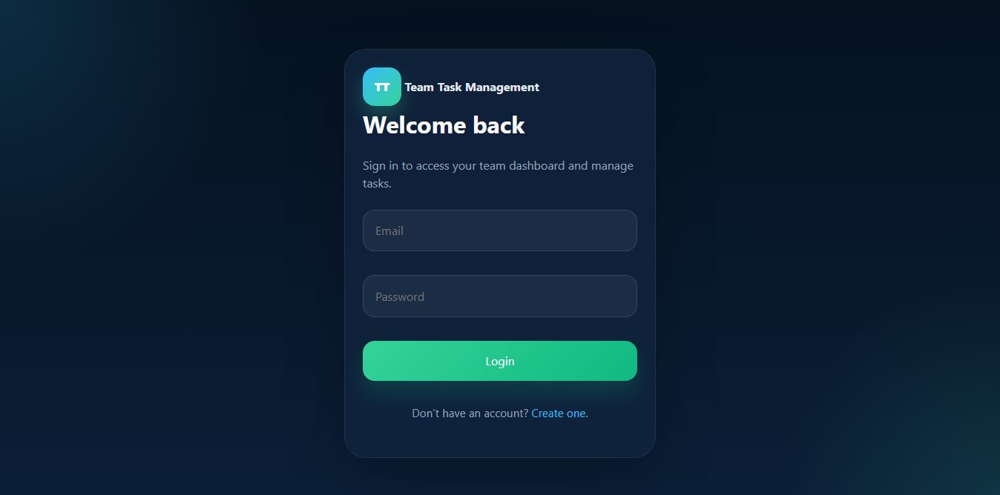
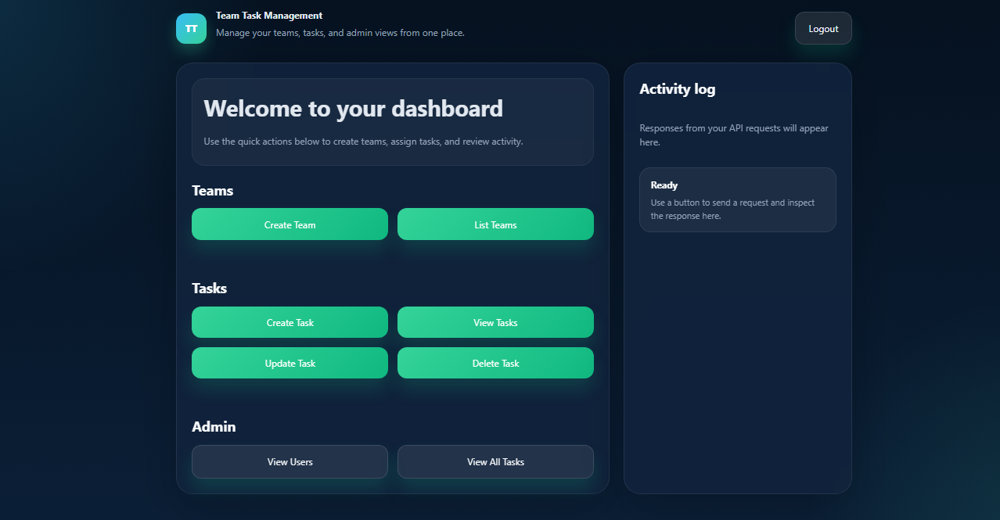
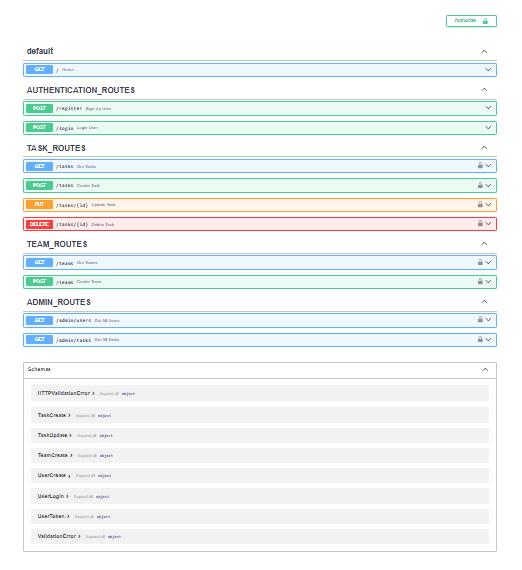

# Team Task Management System

A backend application built with FastAPI and PostgreSQL for managing teams and tasks. The system supports user authentication, role-based access control, team creation, task assignment, and task management.

## Features

* User Registration & Login
* JWT Authentication
* Role-Based Access Control (Admin/User)
* Create and Manage Teams
* Create, Update, and Delete Tasks
* Assign Tasks to Users
* PostgreSQL Database Integration
* FastAPI Interactive Documentation
* Simple Dashboard UI

## Tech Stack

* FastAPI
* PostgreSQL
* SQLAlchemy
* JWT Authentication
* Pydantic
* Python

## API Endpoints

### Authentication

* `POST /register`
* `POST /login`

### Teams

* `POST /teams`
* `GET /teams`

### Tasks

* `POST /tasks`
* `GET /tasks`
* `PUT /tasks/{id}`
* `DELETE /tasks/{id}`

### Admin

* `GET /admin/users`
* `GET /admin/tasks`

## Installation

1. Clone the repository

```bash
git clone <repository-url>
cd team_task_management
```

2. Create a virtual environment

```bash
python -m venv venv
```

3. Install dependencies

```bash
pip install -r requirements.txt
```

4. Configure environment variables

Create a `.env` file:

```env
DATABASE_URL=your_database_url
JWT_SECRET_KEY=your_secret_key
JWT_ALGORITHM=HS256
TOKEN_EXPIRY_TIME=3600
```

5. Run the application

```bash
uvicorn app.main:app --reload
```

## API Documentation

After starting the server, open:

```text
http://localhost:8000/docs
```

## Project Structure

```text
app/
├──frontend/
├── models/
├── routes/
├── schemas/
├── database.py
├── security.py
└── main.py

frontend/ 
├── login.html 
├── register.html 
├── dashboard.html 
├── style.css
```

```md
## Screenshots

### Login

### Dashboard


### API Documentation


## Future Improvements

* Team member management UI
* Task filtering and search
* Email notifications
* Activity Tracking


## Author
   BALMUKUND PANDEY
